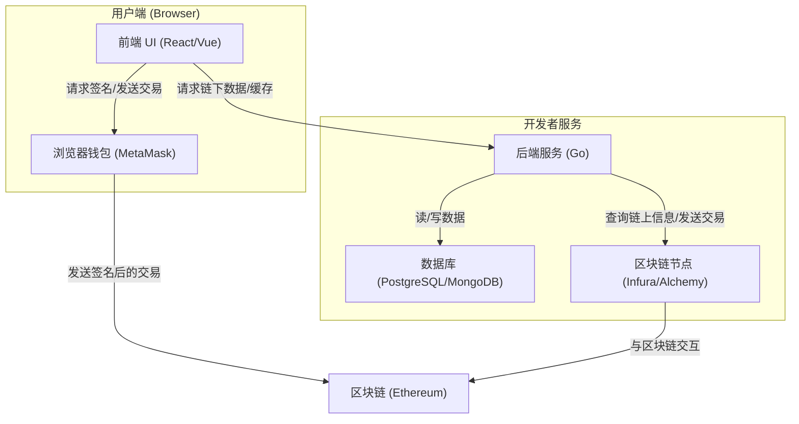

# 3.3: DApp 架构与前后端交互

理解了如何用 Go 与区块链进行后端交互后，我们需要将视野拉高，看看一个完整的去中心化应用 (DApp) 是如何构建的。一个典型的 DApp 不仅仅是智能合约，它是一个集成了前端、后端和区块链三者的系统。

## 1. 典型 DApp 架构

一个标准的 Web3 DApp 架构通常如下：

**核心组件说明:**

- **前端 (Frontend)**: 这是用户直接交互的界面，通常使用 React, Vue 等现代框架构建。
  - **关键作用**:
    1.  展示从后端或直接从区块链读取的数据。
    2.  通过 `ethers.js` 或 `web3.js` 等库与用户的浏览器钱包 (如 MetaMask) 交互，请求用户对交易进行签名。

- **浏览器钱包 (Browser Wallet)**: 例如 MetaMask，是用户的私钥管理器和交易签名工具。
  - **关键作用**:
    1.  安全地保管用户的私钥，私钥永远不会离开钱包。
    2.  当 DApp 前端需要发送交易或签名消息时，钱包会弹出窗口请求用户授权。
    3.  将用户签名后的交易广播到区块链网络。

- **后端 (Backend)**: 在我们的场景中，是 Go 服务。
  - **关键作用**:
    1.  **处理复杂或需要高频读取的链上数据**：直接在前端频繁请求链上数据会很慢且增加节点服务商的负担。后端可以作为缓存层，聚合数据后提供给前端。
    2.  **执行需要中心化服务器密钥的自动化任务**：例如，一个游戏后端需要定期给参与活动的用户空投奖励，这个操作的发起者是后端服务器，而不是某个具体用户。
    3.  **存储链下数据**：很多 DApp 仍然需要传统数据库来存储用户信息、配置或其他不适合上链的数据。
    4.  **连接第三方服务**: 如发送邮件通知、集成社交媒体等。

- **区块链节点 (Node Provider)**: 像 Infura, Alchemy 这样的服务，是后端访问区块链的入口。

## 2. 前后端交互流程解析

DApp 的交互模式与传统 Web2 应用有很大不同，主要区别在于 **"谁来签名交易"**。

### 2.1 用户发起的写操作 (如：NFT MINT)

这是最常见的 DApp 交互模式。

1.  **前端**: 用户在网页上点击"Mint NFT"按钮。
2.  **前端**: 前端应用构建一个调用 NFT 合约 `mint` 函数的交易对象。
3.  **前端 -> 钱包**: 前端通过 Ethers.js 将这个交易对象发送给 MetaMask，请求用户签名。
4.  **钱包**: MetaMask 弹出确认窗口，显示交易详情（Gas费、目标合约等）。
5.  **用户**: 用户点击"确认"。
6.  **钱包 -> 区块链**: MetaMask 将用户签名好的交易广播到以太坊网络。
7.  **(可选) 后端**: 后端服务通过监听合约的 `Transfer` 事件，一旦发现新的 Mint 发生，就更新自己的数据库（例如，记录哪个用户 Mint 了哪个 NFT），以便前端可以快速查询。

**关键点**: 在这个流程中，交易是由 **用户自己的钱包** 签名的，后端 **不参与** 签名过程，只是一个观察者和数据缓存/聚合者。

### 2.2 后端发起的写操作 (如：自动发奖)

在某些场景下，交易必须由一个中心化的实体来发起。

1.  **后端**: 一个定时任务触发，或者一个 API 被调用，需要给用户 `0xABC...` 发送一个奖励代币。
2.  **后端**: Go 服务加载自己保管的 **服务器钱包私钥**。
3.  **后端**: 构建一个调用代币合约 `transfer` 函数的交易，将代币从服务器钱包地址发送到用户地址。
4.  **后端**: 使用服务器私钥对交易进行签名。
5.  **后端 -> 节点**: 将签名后的交易通过 RPC 发送给 Infura/Alchemy 节点。
6.  **节点 -> 区块链**: 节点将交易广播到以太坊网络。

**关键点**: 在这个流程中，交易是由 **后端服务器的钱包** 签名的。这要求后端必须安全地管理自己的私钥。

## 3. 设计链下与链上通信的 API

基于以上架构，Go 后端通常需要提供以下几类 API 给前端：

- **`GET /api/nfts?owner={address}`**
  - **功能**: 查询某个地址拥有的所有 NFT。
  - **实现**: 后端通过监听链上事件，已经将 NFT 的归属信息缓存在了数据库中。这个 API 直接查询数据库，而不是实时查询区块链，因此响应速度非常快。

- **`GET /api/contract/info`**
  - **功能**: 获取合约的一些基本信息，如 `totalSupply`, `MAX_SUPPLY` 等。
  - **实现**: 后端在启动时或定期从链上读取这些不常变化的数据，并缓存起来，通过 API 提供给前端。

- **`POST /api/user/profile`**
  - **功能**: 用户更新自己的个人资料（如用户名、头像），这些信息不适合上链。
  - **实现**: 这是一个传统的 Web2 API。前端可能会要求用户进行一次"签名消息"操作 (`personal_sign`) 来验证身份，然后将签名和数据一起发给后端，后端验证签名后更新数据库。

通过这种"链上+链下"结合的混合架构，我们可以扬长避短，既利用了区块链的去中心化和不可篡改性，又保证了应用的性能和灵活性。 